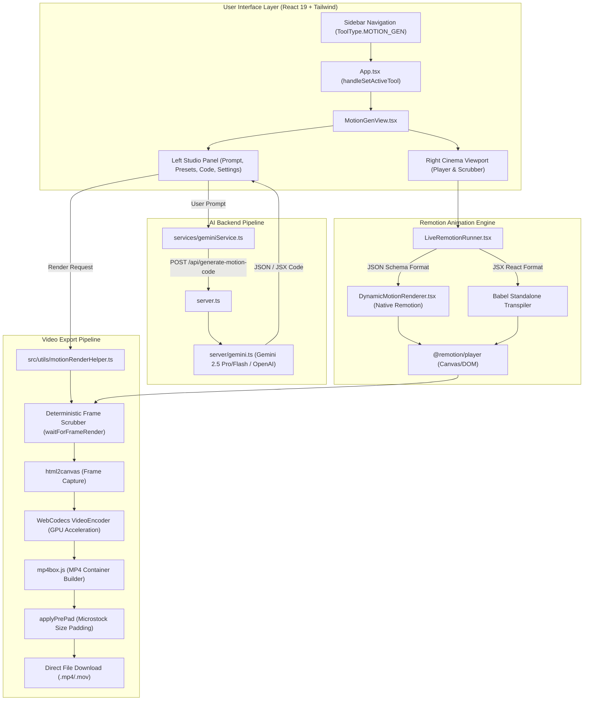

# PRODUCT REQUIREMENTS DOCUMENT (PRD)
## MotionGen Studio — Next-Gen AI Motion Graphics & Video Engine for MetaZo PRO

---

| **Dokumen** | Product Requirements Document (PRD) |
| :--- | :--- |
| **Fitur** | **MotionGen Studio (AI Motion Graphics & Video Generator)** |
| **Aplikasi** | MetaZo PRO (Adobe Stock & Microstock AI Assistant) |
| **Versi Target** | v1.4.0 (Revival Release) |
| **Status** | **Ready for Implementation** |
| **Kategori** | Core Creative Suite / Video Generation |
| **Terakhir Diperbarui** | September 2026 |

---

## 1. Executive Summary & Latar Belakang

### 1.1 Ringkasan Produk
**MotionGen Studio** adalah modul generator grafis gerak (*motion graphics*) dan animasi video berbasis kecerdasan buatan (*AI-driven*) yang terintegrasi langsung ke dalam ekosistem MetaZo PRO. Fitur ini dirancang khusus untuk para kontributor microstock (Adobe Stock Video, Shutterstock Footage, Pond5, Videohive) serta konten kreator modern untuk memproduksi aset video berkualitas komersial (*broadcast-ready*) hanya melalui prompt teks bahasa manusia (*natural language prompt*) atau template preset siap pakai.

Fitur ini ditenagai oleh kombinasi:
1. **Remotion 4.x Engine**: Framework rendering video React berbasis frame matematis deterministik.
2. **Dual-Architecture Execution**:
   - *Structured Motion Schema*: Engine deklaratif JSON bawaan yang 100% bebas error kompilasi runtime.
   - *Dynamic Babel Standalone*: Evaluator JSX untuk kustomisasi kode animasi tingkat lanjut.
3. **WebCodecs GPU & MP4Box Muxer**: Pipeline ekspor video langsung di browser klien tanpa beban server mahal, menghasilkan video MP4 H.264 presisi tinggi dengan bitrate tinggi (hingga 80 Mbps) dan opsi padding ukuran file untuk memenuhi standar kurasi microstock.

### 1.2 Masalah Saat Ini (Root Cause Analysis)
Saat ini fitur Motion Gen **tidak dapat diakses atau dianggap belum berfungsi oleh pengguna** karena beberapa faktor teknis spesifik di dalam basis kode:
1. **Navigasi Terkunci (*Hard-Blocked*) di `App.tsx`**:
   Pada fungsi `handleSetActiveTool()` di `App.tsx` (baris 2128–2131), setiap klik pada tab Motion Gen diintersep paksa dengan pemanggilan `setComingSoonFeature('motion_gen')`, yang selalu memunculkan modal pop-up *"Fitur MotionGen Sedang Dalam Tahap Pengembangan"* dan membatalkan pergantian tampilan.
2. **Mismatch ID Kontainer Frame Rendering**:
   Pada modul `src/utils/motionRenderHelper.ts`, engine rendering mencari elemen ID `remotion-pure-render-stage`, sedangkan di `src/components/MotionGenView.tsx` elemen player dibungkus dengan ID `motion-gen-player`. Hal ini dapat menyebabkan fallback screenshot yang kurang akurat atau frame kosong saat ekspor video.
3. **Harmonisasi Prompt Generator AI**:
   Endpoint AI `/api/generate-motion-code` di `server/gemini.ts` menghasilkan kode mentah JSX Remotion, sedangkan default editor menggunakan format deklaratif *Motion Project JSON Schema*. Dibutuhkan output format yang adaptif (mendukung visual native renderer JSON sekaligus fallback JSX).
4. **Duplikasi File Usang (*Stale Files*)**:
   Terdapat file sisa `LiveRemotionRunner.tsx` dan `motionRenderHelper.ts` di direktori root yang berukuran lebih kecil dan tidak terpakai, berpotensi menimbulkan kebingungan referensi modul jika ter-import secara tidak sengaja.

---

## 2. Tujuan & Sasaran (*Goals & Objectives*)

### 2.1 Tujuan Utama
Mengaktifkan kembali (*revive*) fitur Motion Gen secara penuh di aplikasi MetaZo PRO sehingga pengguna dapat:
1. Membuka tab **Motion Gen** langsung dari Sidebar tanpa dihalangi modal *Coming Soon*.
2. Melakukan *vibe-coding* dan generate animasi video melalui AI Chat Prompt dalam bahasa Indonesia maupun Inggris.
3. Memilih dan memuat preset animasi siap pakai (Branding & Logos, Social & YouTube, Cyberpunk/Tech Promo).
4. Melihat *real-time preview* animasi secara interaktif di layar Cinema Viewport dengan playback controls, loop, dan rasio canvas (16:9, 9:16, 1:1).
5. Melakukan ekspor video MP4/MOV resolusi tinggi (720p, 1080p, 2K, 4K) dengan WebCodecs hardware acceleration dan menyimpan file ke perangkat lokal.

### 2.2 Metrik Keberhasilan (*Success Metrics*)
- **Aksesibilitas**: 100% pengguna (Free maupun Licensed PRO) dapat mengakses antarmuka MotionGen Studio.
- **Waktu Render Ekspor**: Render video 1080p 5 detik (150 frames @30fps) selesai di browser dalam waktu < 20 detik pada browser modern berkemampuan WebCodecs.
- **Tingkat Keberhasilan Kompilasi**: > 95% prompt AI berhasil di-render tanpa memicu error Babel atau runtime crash.
- **Kesesuaian Microstock**: File MP4 keluaran lolos verifikasi standar Adobe Stock (profil warna YUV420p, framerate konstan, resolusi genap, dan opsi padding ukuran file).

---

## 3. Arsitektur Sistem & Komponen



---

## 4. Spesifikasi Fitur Detail

### 4.1 F1: Navigasi & Integrasi Core MetaZo
- **Routing**: Path `/MotionGen` terhubung ke `ToolType.MOTION_GEN`.
- **Sidebar Integration**:
  - Tombol sidebar menampilkan icon `Video`, label `"Motion Gen"`, serta indikator aktif bergaris aksen indigo/ungu.
  - Klik pada tombol langsung memindahkan `activeTool` ke `ToolType.MOTION_GEN` tanpa memanggil modal *Coming Soon*.
- **License & Kuota Handling**:
  - **Akun Gratis (*Free User*)**: Dibatasi 25 kali generate per hari (`FREE_DAILY_LIMIT = 25`). Jika kuota habis, modal limit aktivasi ditampilkan.
  - **Akun PRO (*Licensed*)**: Bebas kuota harian (*Unlimited Generation*).
  - Status pemakaian ditampilkan di header bar Studio (`dailyGenCount / FREE_DAILY_LIMIT`).

### 4.2 F2: Prompt Studio & Vibe-Coding AI
- **Input Chat Interaktif**:
  - Kolom textarea untuk mendeskripsikan animasi (contoh: *"Buat logo reveal modern dengan efek neon glow dan teks 'MetaZo Studio'"*).
  - Mendukung penekanan tombol `Enter` untuk generate dan `Shift + Enter` untuk baris baru.
- **Histori Percakapan (*Conversational Memory*)**:
  - Menampilkan bubble chat user dan asisten AI.
  - AI mengingat konteks percakapan sebelumnya untuk iterasi desain (misal: *"Ubah warnanya menjadi oranye gradasi"* atau *"Percepat animasinya"*).
- **AI Auto-Fix Engine**:
  - Jika terjadi kesalahan kompilasi atau sintaks JSX/JSON, muncul *Diagnostic Error HUD* di bawah layar player.
  - Tombol **"AI Auto-Fix"** secara otomatis mengirimkan pesan error ke AI untuk mereparasi kode dan memuat ulang animasi tanpa kehilangan progress.

### 4.3 F3: Presets & Template Library
Pilihan preset langsung pakai yang dikategorikan:
1. **Branding & Logos**:
   - *Logo Reveal Glow*: Partikel glow neon, spring bounce halus & typography gradasi.
   - *3D Glossy Cube Stinger*: Rotasi kubus 3D isometrik dengan specular glassmorphism glow.
2. **Social & YouTube**:
   - *YouTube Subscribe Pop*: Tombol subscribe interaktif, lonceng notifikasi berdering & kursor klik.
   - *Cinematic Lower Third*: Glassmorphism bar identitas narasumber dan profesi.
   - *Social Follow Reels Overlay*: Floating badge Instagram & TikTok untuk video vertikal 9:16.
3. **Tech & Promo**:
   - *Cyberpunk HUD Counter*: Scanline neon, grid digital, dan penghitung angka 0% ke 100%.
   - *Mega Sale 50% Off Promo*: Badge diskon 3D berputar dengan efek visual menyala.

### 4.4 F4: Live Remotion Cinema Viewport
- **Player Container**:
  - Tampilan monitor cinema gelap (*dark canvas*) dengan rasio fleksibel:
    - **16:9 Landscape** (1920x1080 / 3840x2160) untuk YouTube dan footage microstock horizontal.
    - **9:16 Portrait** (1080x1920) untuk Reels, TikTok, dan Shorts.
    - **1:1 Square** (1080x1080) untuk Instagram Feed post.
- **Interactive Controls**:
  - Play, pause, scrub frame slider, timecode, loop toggle, dan audio mute/unmute.
  - Menggunakan `@remotion/player` resmi v4.0.x.

### 4.5 F5: Code Inspector & Schema Editor
- Tab kode dengan *syntax highlighting* untuk membaca struktur animasi.
- Fitur **Copy Code** ke clipboard.
- Kemampuan beralih antara format **JSON Project Schema** (bebas error) dan **JSX Code** (full custom React hooks).
- Fitur **Reset** untuk mengembalikan kode ke template default bila pengguna ingin memulai dari awal.

### 4.6 F6: Render & Export Engine (Microstock Grade)
Pengaturan ekspor video komprehensif di Tab Settings:
- **Pilihan Resolusi**: 720p (HD), 1080p (Full HD), 2K (Quad HD), 4K (Ultra HD).
- **Framerate**: 24 FPS (Cinematic), 30 FPS (Standard Web), 60 FPS (Ultra Smooth).
- **Skala Resolusi (*Resolution Scale*)**: 0.75x, 1.0x (Native), 1.25x, 1.5x, 2.0x (Super Resolution).
- **Target Bitrate**:
  - Standard Web (8 Mbps)
  - Commercial High (25 Mbps)
  - Cinema Master (45 Mbps)
  - Extreme Microstock (80 Mbps)
- **Format Kontainer**: MP4 (H.264 / AVC) dan MOV (QuickTime).
- **Microstock Minimum File Size Padding (`minSizePadMb`)**:
  - Pilihan: Off (0 MB), 50 MB, 100 MB, 200 MB, 500 MB.
  - Menyisipkan byte padding nol (*zero-padded binary chunk*) ke dalam kontainer video untuk memenuhi aturan minimum file size agensi microstock tertentu (seperti minimum 50MB-100MB di platform tertentu).
- **Mode Render**:
  - `deterministic-worker` (Recommended): WebCodecs GPU + MP4Box. Frame-perfect zero-drift.
  - `universal-mp4`: High-precision MediaRecorder fallback untuk browser lawas.
  - `realtime-stream`: Capture streaming langsung dari canvas Remotion.

---

## 5. Spesifikasi Teknis & Skema Data

### 5.1 Skema Data Proyek Motion (JSON Schema)
```typescript
export interface MotionProject {
  title: string;
  description?: string;
  fps: number;
  durationInFrames: number;
  background: {
    type: 'gradient' | 'mesh' | 'solid' | 'radial' | 'particles' | 'grid';
    colors: string[];
    animated?: boolean;
    angle?: number;
  };
  scenes: MotionScene[];
}

export interface MotionScene {
  id: string;
  from: number;
  durationInFrames: number;
  transition?: 'fade' | 'slide-up' | 'slide-down' | 'zoom' | 'wipe' | 'none';
  elements: MotionElement[];
}

export interface MotionElement {
  id: string;
  type: 'heading' | 'subtitle' | 'text' | 'badge' | 'card' | 'icon' | 'shape' | 'counter' | 'progress' | 'button' | 'avatar';
  content?: string;
  iconName?: string;
  layout: {
    align?: 'left' | 'center' | 'right';
    maxWidth?: string;
  };
  style: {
    fontSize?: number;
    fontWeight?: number | string;
    color?: string;
    backgroundColor?: string;
    gradient?: string[];
    borderRadius?: number;
    boxShadow?: string;
  };
  animation: {
    type: 'spring-in' | 'bounce-in' | 'slide-up' | 'slide-down' | 'slide-left' | 'slide-right' | 'zoom-in' | 'pulse' | 'float' | 'glow-pulse' | 'typewriter' | 'rotate-continuous' | 'none';
    delay?: number;
    damping?: number;
  };
}
```

### 5.2 Kontrak API Backend
- **Endpoint**: `POST /api/generate-motion-code`
- **Request Body**:
  ```json
  {
    "prompt": "Buatkan animasi countdown 5 detik gaya modern cyberpunk",
    "currentCode": "...",
    "fps": 30,
    "durationSeconds": 5,
    "width": 1920,
    "height": 1080,
    "history": [
      { "role": "user", "content": "..." },
      { "role": "assistant", "content": "..." }
    ],
    "model": "gemini-2.5-pro"
  }
  ```
- **Response**:
  ```json
  {
    "title": "Cyberpunk 5s Countdown",
    "summary": "Animasi countdown modern dengan grid futuristik dan partikel glow.",
    "code": "..." 
  }
  ```

---

## 6. Rencana Tindakan Teknis (*Implementation Roadmap to Revive*)

Untuk membuat fitur Motion Gen berfungsi kembali 100%, berikut 5 langkah perbaikan utama:

### Langkah 1: Buka Blokir Navigasi di `App.tsx`
- **Lokasi**: `App.tsx` (baris ~2127–2132)
- **Tindakan**: Hapus blok intersep:
  ```typescript
  // SEBELUM:
  const handleSetActiveTool = (tool: ToolType) => {
    if (tool === ToolType.MOTION_GEN) {
      setComingSoonFeature('motion_gen');
      return;
    }
    setActiveTool(tool);
    ...
  }

  // SESUDAH:
  const handleSetActiveTool = (tool: ToolType) => {
    setActiveTool(tool);
    const path = toolToPath[tool] || '/Dashboard';
    ...
  }
  ```

### Langkah 2: Sinkronisasi ID Elemen Render Stage
- **Lokasi**: `src/components/MotionGenView.tsx` & `src/utils/motionRenderHelper.ts`
- **Tindakan**: 
  - Pastikan `startMotionRender('motion-gen-player', ...)` dapat menemukan node canvas Player secara langsung, atau tambahkan ID `remotion-pure-render-stage` pada elemen pembungkus player agar `captureFrameToCanvas()` selalu mengambil snapshot murni tanpa kontrol UI overlay.

### Langkah 3: Bersihkan Berkas Usang di Root
- **Tindakan**: Hapus atau arsipkan berkas usang:
  - `./LiveRemotionRunner.tsx` (lama)
  - `./motionRenderHelper.ts` (lama)
  Gunakan berkas modern di `src/components/remotion/LiveRemotionRunner.tsx` dan `src/utils/motionRenderHelper.ts`.

### Langkah 4: Sempurnakan Dual-Mode AI Generator di `server/gemini.ts`
- **Tindakan**: Optimalkan prompt system agar model AI memprioritaskan format **JSON Schema `MotionProject`** yang langsung dimuat oleh `DynamicMotionRenderer` tanpa kompilasi Babel, dengan fallback ke JSX komponen `MotionComposition`.

### Langkah 5: Pengujian End-to-End & Verifikasi Build
- **Tindakan**:
  - Test navigasi menu sidebar -> halaman MotionGen Studio terbuka mulus.
  - Test AI generator dengan prompt bahasa Indonesia & Inggris.
  - Test live preview & scrub timecode.
  - Test ekspor render MP4 1080p & verifikasi unduhan file lokal.

---

## 7. Rencana Pengujian (*Testing & Verification Plan*)

| ID Test | Skenario Pengujian | Hasil yang Diharapkan |
| :--- | :--- | :--- |
| **TC-01** | Pengguna mengklik menu **Motion Gen** di Sidebar. | Halaman MotionGen Studio terbuka secara penuh, URL berubah menjadi `/MotionGen`, dan TIDAK ADA pop-up Coming Soon. |
| **TC-02** | Pengguna memilih salah satu Preset (misal: *YouTube Subscribe Pop*). | Preview player langsung memperbarui animasi dan memutar motion subscribe button. |
| **TC-03** | Pengguna mengetik prompt kustom di Chat Studio dan menekan Enter. | Asisten AI merespons, status generating aktif, dan kode animasi baru ditampilkan di player. |
| **TC-04** | Pengguna mengubah rasio dari 16:9 ke 9:16 (Vertikal). | Viewport player berubah ukuran aspek secara mulus dan animasi menyesuaikan layout. |
| **TC-05** | Pengguna menekan tombol **Ekspor Video**. | Progress bar rendering berjalan dari 0% ke 100% (Preparing -> Rendering Frames -> Encoding -> Done), lalu file `.mp4` terunduh otomatis. |
| **TC-06** | Pengguna dengan akun gratis mencapai 25 kali generate. | Modal limit muncul menginformasikan kuota harian tercapai dan menawarkan aktivasi lisensi PRO. |

---

## 8. Kesimpulan
Modul MotionGen Studio di MetaZo PRO sudah memiliki fondasi arsitektur yang sangat matang dan canggih (Remotion, WebCodecs GPU, AI Vibe-Coding). Dengan mengeksekusi 5 langkah di atas, fitur ini dapat **seketika aktif dan berfungsi 100%** untuk kebutuhan kontributor microstock dan kreator video.
